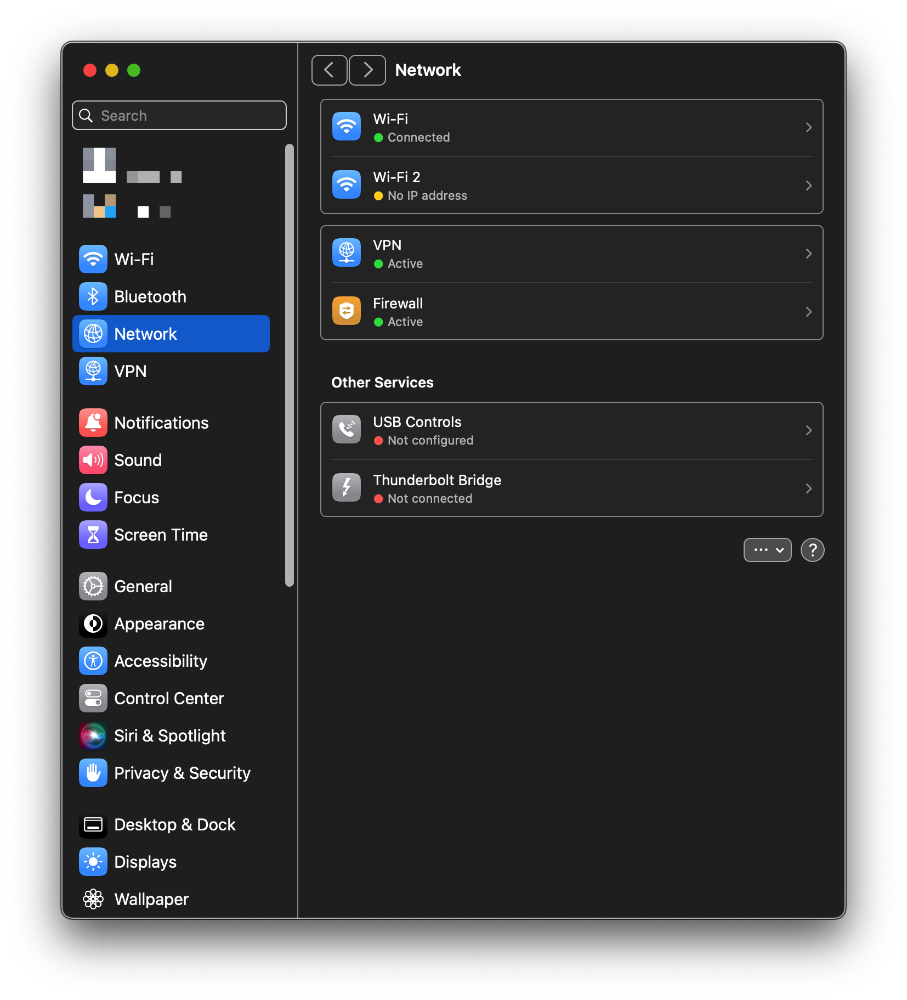
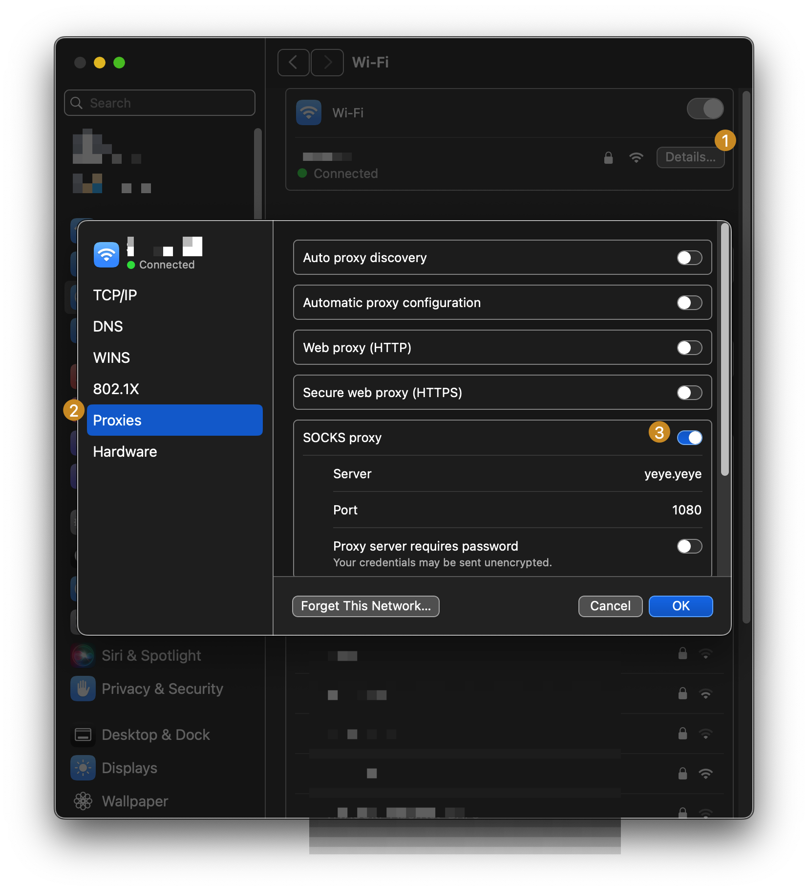

# Crafting an On-Demand VPN Alternative with "SOCKS Proxy"

Hey there, sharing a nifty tech thing I stumbled working on as I was looking to recreate something I had used in the past to escape the geo fencing hell without relaying on major subscription services, or any pesky VPS provider. 

The on-demand VPN feature for macOS may be a little bit tricky to configure through the GUI and without going through device management configuration tools.

## Make sure you've got

- macOS.
- A functioning IKEv2 tunnel or alike.
- Creativity with bogus names.

## Step 1: Open your current Network settings

## Step 2: Select the adapter's details

## Step 3: "Configure" the SOCKS Proxy

1. Enable the "SOCKS Proxy" option.
2. Set a bogus server

## Step 4: Enjoy a kill-switch

I haven't tested everything thoroughly, but seemed like an easy way to quit the default behavior and await until you've re-connected to your network.

A future update may follow with some more testing, but in the meantime it looks like a solution.